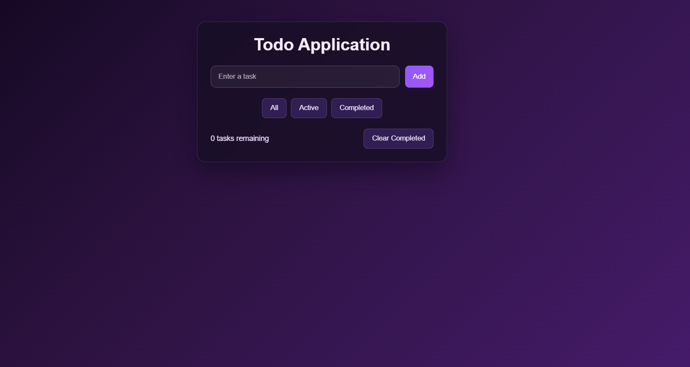

# Ex03 To-Do List using JavaScript
# Date: 17.08.2026
## AIM
To create a To-do Application with all features using JavaScript.

## ALGORITHM
### STEP 1
Build the HTML structure (index.html).

### STEP 2
Style the App (style.css).

### STEP 3
Plan the features the To-Do App should have.

### STEP 4
Create a To-do application using Javascript.

### STEP 5
Add functionalities.

### STEP 6
Test the App.

### STEP 7
Open the HTML file in a browser to check layout and functionality.

### STEP 8
Fix styling issues and refine content placement.

### STEP 9
Deploy the website.

### STEP 10
Upload to GitHub Pages for free hosting.

## PROGRAM
```
HTML
<!DOCTYPE html>
<html lang="en">
<head>
  <meta charset="UTF-8">
  <meta name="viewport" content="width=device-width, initial-scale=1.0">
  <title>Todo Application</title>
  <link rel="stylesheet" href="style.css">
</head>

<body>

  <div class="container">
    <h1>Todo Application</h1>

    <div class="input-box">
      <input type="text" id="todoInput" placeholder="Enter a task">
      <button onclick="addTodo()">Add</button>
    </div>

    <div class="filters">
      <button onclick="filterTodos('all')">All</button>
      <button onclick="filterTodos('active')">Active</button>
      <button onclick="filterTodos('completed')">Completed</button>
    </div>

    <ul id="todoList"></ul>

    <div class="bottom">
      <span id="count">0 tasks</span>
      <button onclick="clearCompleted()">Clear Completed</button>
    </div>
  </div>

  <script src="script.js"></script>
</body>
</html>

CSS

body {
  margin: 0;
  min-height: 100vh;
  font-family: Arial, sans-serif;
  background: linear-gradient(135deg, #12071f 0%, #2a123d 35%, #4b1d73 100%);
  display: flex;
  justify-content: center;
  align-items: flex-start;
  padding: 50px 16px;
  color: #f3e8ff;
}

.container {
  width: 420px;
  background: rgba(22, 14, 36, 0.8);
  backdrop-filter: blur(8px);
  padding: 25px;
  border-radius: 16px;
  box-shadow: 0 20px 45px rgba(12, 3, 23, 0.5);
  border: 1px solid rgba(206, 168, 255, 0.18);
}

h1 {
  text-align: center;
  color: #f5ebff;
  margin-top: 0;
}

.input-box {
  display: flex;
  gap: 10px;
}

.input-box input {
  flex: 1;
  padding: 12px 14px;
  background: rgba(255, 255, 255, 0.06);
  border: 1px solid rgba(212, 172, 255, 0.3);
  border-radius: 10px;
  color: #f5ebff;
  outline: none;
}

.input-box input::placeholder {
  color: rgba(245, 235, 255, 0.65);
}

button {
  padding: 10px 15px;
  border: none;
  background: linear-gradient(135deg, #8b5cf6, #a855f7);
  color: white;
  cursor: pointer;
  border-radius: 8px;
  transition: opacity 0.2s ease, transform 0.2s ease;
}

button:hover {
  opacity: 0.95;
  transform: translateY(-1px);
}

.filters {
  display: flex;
  justify-content: center;
  gap: 8px;
  margin: 20px 0;
}

.filters button,
.actions button,
.bottom button {
  background: rgba(139, 92, 246, 0.2);
  border: 1px solid rgba(212, 172, 255, 0.22);
  color: #f5ebff;
}

#todoList {
  list-style: none;
  padding: 0;
  margin: 0;
}

.todo {
  display: flex;
  align-items: center;
  justify-content: space-between;
  padding: 12px 10px;
  border-bottom: 1px solid rgba(212, 172, 255, 0.16);
  background: rgba(255, 255, 255, 0.02);
  border-radius: 8px;
  margin-bottom: 8px;
}

.todo span {
  flex: 1;
  margin-left: 10px;
  color: #f3e8ff;
}

.completed {
  text-decoration: line-through;
  color: #b29ad8;
}

.actions button {
  margin-left: 5px;
  padding: 5px 8px;
}

.bottom {
  display: flex;
  justify-content: space-between;
  align-items: center;
  margin-top: 20px;
  font-size: 14px;
  color: #e9ddff;
}

Javascript

let todos = JSON.parse(localStorage.getItem("todos")) || [];
let currentFilter = "all";

function saveTodos() {
  localStorage.setItem("todos", JSON.stringify(todos));
}

function addTodo() {
  const input = document.getElementById("todoInput");
  const text = input.value.trim();

  if (text === "") {
    alert("Please enter a task");
    return;
  }

  const todo = {
    id: Date.now(),
    text: text,
    completed: false
  };

  todos.push(todo);

  input.value = "";

  saveTodos();
  displayTodos();
}

function displayTodos() {
  const list = document.getElementById("todoList");
  list.innerHTML = "";

  let filteredTodos = todos;

  if (currentFilter === "active") {
    filteredTodos = todos.filter(todo => !todo.completed);
  }

  if (currentFilter === "completed") {
    filteredTodos = todos.filter(todo => todo.completed);
  }

  filteredTodos.forEach(todo => {

    const li = document.createElement("li");
    li.className = "todo";

    li.innerHTML = `
      <input
        type="checkbox"
        ${todo.completed ? "checked" : ""}
        onchange="toggleTodo(${todo.id})"
      >

      <span class="${todo.completed ? "completed" : ""}">
        ${todo.text}
      </span>

      <div class="actions">
        <button onclick="editTodo(${todo.id})">Edit</button>
        <button onclick="deleteTodo(${todo.id})">Delete</button>
      </div>
    `;

    list.appendChild(li);
  });

  updateCount();
}

function toggleTodo(id) {
  todos = todos.map(todo => {
    if (todo.id === id) {
      todo.completed = !todo.completed;
    }

    return todo;
  });

  saveTodos();
  displayTodos();
}

function editTodo(id) {
  const todo = todos.find(todo => todo.id === id);

  const newText = prompt("Edit your task:", todo.text);

  if (newText !== null && newText.trim() !== "") {
    todo.text = newText.trim();

    saveTodos();
    displayTodos();
  }
}

function deleteTodo(id) {
  todos = todos.filter(todo => todo.id !== id);

  saveTodos();
  displayTodos();
}

function filterTodos(filter) {
  currentFilter = filter;
  displayTodos();
}

function clearCompleted() {
  todos = todos.filter(todo => !todo.completed);

  saveTodos();
  displayTodos();
}

function updateCount() {
  const activeTodos = todos.filter(todo => !todo.completed);

  document.getElementById("count").textContent =
    `${activeTodos.length} tasks remaining`;
}

displayTodos();

```

## OUTPUT


## RESULT
The program for creating To-do list using JavaScript is executed successfully.